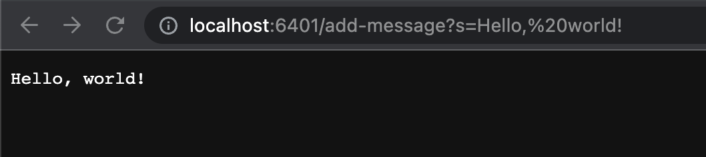
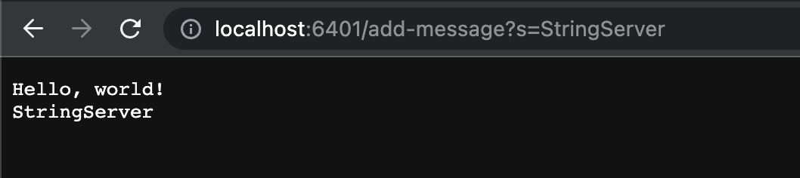
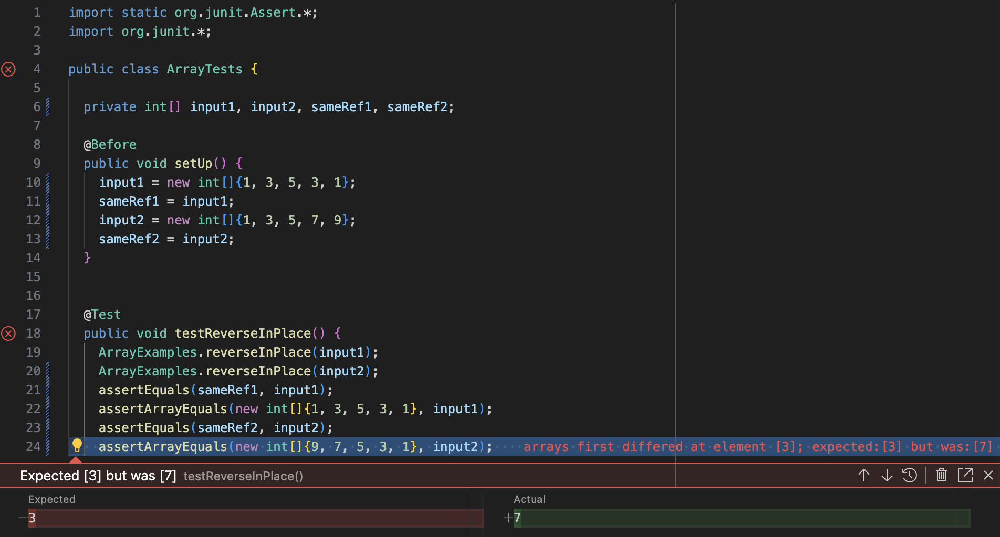

# Lab Report 2
Name: Arjun Sarup

PID: A17527244

Email: asarup@ucsd.edu

---

## Part 1 - StringServer

For this section of the lab, I created a file called StringServer.java that operates on a local port and allows the user to add strings to a list and see the contents. My implementation can be seen in the code below:

```
import java.io.IOException;
import java.net.URI;

class Handler implements URLHandler {
    String result = "";

    public String handleRequest(URI url){
        
        if(url.getQuery() != null) {
            String[] parameters = url.getQuery().split("=");
            if(url.getPath().equals("/add-message")) {
                if(parameters[0].equals("s")) {
                    result += (result == "" ? "" : "\n") + parameters[1];
                    return result;
                }
            } 
        }
        return "";
    }
}

class StringServer {
    public static void main(String[] args) throws IOException {
        if(args.length == 0){
            System.out.println("Missing port number! Try any number between 1024 to 49151");
            return;
        }

        int port = Integer.parseInt(args[0]);

        Server.start(port, new Handler());
    }
}
```

Essentially, once the server is created, if the path contains something of the form `/add-message?s=[STRING]`, then the `[STRING]` is concatenated to the output, with each string separated by a new line. (It's worth noting that the `URLHandler` interface that my progam implements can be found in the Server.java file from the wavelet repo.) The results look something like this:

1) 
In this example, the URL is `localhost:6401/add-message?s=Hello, world!` (the `%20` in the example is read as a space). This URL is passed to the `handleRequest(URI url)` method of the `Handler()` object, which was created in with `Server.start(port, new Handler());` when the program was executed in the terminal. Then, the path of `url` is checked to ensure that it is in the correct format, which it is in this instance. From there, the query is parsed into `s` and `Hello, world!`, and the latter item is concatenated to `result`, which is a String property of the class. Finally, the `result` property is returned, printing it onto the screen.

2) 
Similar to the last example, the `handleRequest(URI url)` method is called, setting `url` equal to `localhost:6401/add-message?s=StringServer`, and `url` is then checked for any invalid format. Since `url` is structured properly, the query is split into `s` and `StringServer`, and StringServer's `result` property is updated to now be the string `Hello, world!\nStringServer`. When `result` is returned, it is printed onto the screen, displaying `Hello, world!` and `StringServer` on separate lines.


## Part 2 - Debugging
One of the bugs I found during this lab was in the `reverseInPlace()` method of the ArrayExamples.java file. Some inputs would pass, but most would fail. For example, the following test would pass:
```
  private int[] input1, sameRef1;

  @Before
  public void setUp() {
    input1 = new int[]{1, 3, 5, 3, 1};
    sameRef1 = input1;
  }

  
  @Test 
	public void testReverseInPlace() {
    ArrayExamples.reverseInPlace(input1);
    assertEquals(sameRef1, input1);
    assertArrayEquals(new int[]{1, 3, 5, 3, 1}, input1);
	}
```
Of course, it would make sense for this to pass even if the method did nothing, since this array input is palindromic. When confronted with something more asymmetrical like the following test, the `reverseInPlace()` method failed.
```
  private int[] input2, sameRef2;

  @Before
  public void setUp() {
    input2 = new int[]{1, 3, 5, 7, 9};
    sameRef2 = input2;
  }

  
  @Test 
	public void testReverseInPlace() {
    ArrayExamples.reverseInPlace(input2);
    assertEquals(sameRef2, input2);
    assertArrayEquals(new int[]{9, 7, 5, 3, 1}, input1);
  }
```
It is noteworthy, though, that in both of these cases, `assertEquals(sameRef, input1);` did pass, meaning that whatever the `reverseInPlace()` method was doing, it was in fact doing so "in place." The JUnit outputs from both of these test cases put together can be seen in the image below:

All of the tests passed except the final one, which was checking to see if an asymmetrical list would be properly reversed. Instead, the result was the same array with the left half of the values overwritten to mirror the right half. This was fixed in two ways:
1) I added lines within the for loop to use a temp variable so that the left values can be swapped with the right values rather than overwritten
2) I changed the number of iterations to the length of the array divided by 2, so the method would stop swapping once the entire left half is swapped with the entire right half, reversing the array
The code before my changes can be seen below:
```
  static void reverseInPlace(int[] arr) {
    for(int i = 0; i < arr.length; i += 1) {
      arr[i] = arr[arr.length - i - 1];
    }
  }
```
And here is the code after my fixes:
```  
  static void reverseInPlace(int[] arr) {
    for(int i = 0; i < arr.length/2; i += 1) {
      int temp = arr[i];
      arr[i] = arr[arr.length - i - 1];
      arr[arr.length - i - 1] = temp;
    } 
  }
```
After implementing this code, all my JUnit tests for the `reverseInPlace()` method passed as expected.

